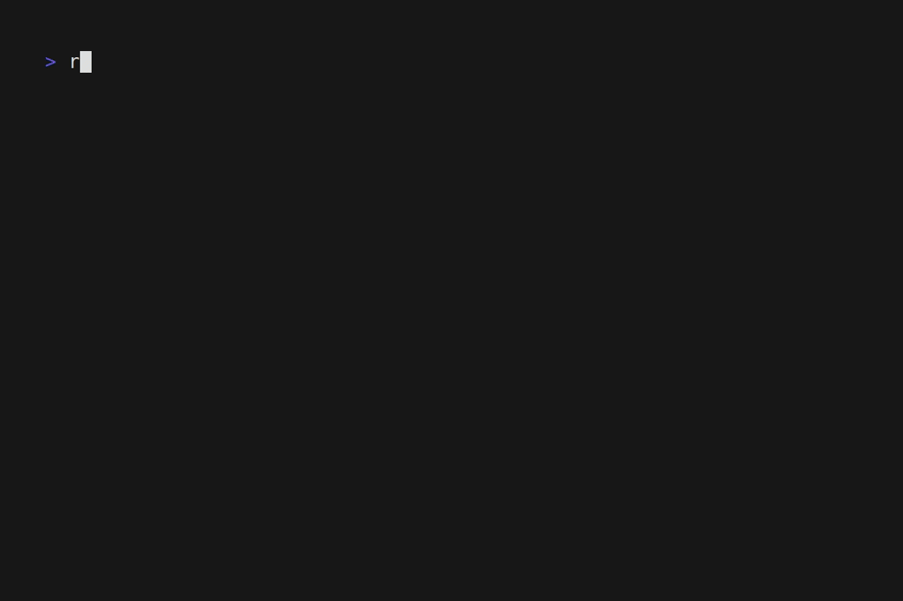

# RetroFITS

A high-performance FITS image viewer for the terminal.

RetroFITS is designed to work with modern terminal emulators, utilizing memory-mapping and zero-copy architectures to handle large astronomical data files efficiently.

## Screenshots

### Halfblocks Protocol



## Features

- High-performance FITS viewing directly in the terminal
- Support for various rendering protocols (Kitty, iTerm2, Sixel, Halfblocks)
- Interactive exploration (zoom, pan, adjust scaling)
- Remote SSH support

## Installation

See [INSTALL.md](INSTALL.md) for detailed installation instructions.

## Usage

```bash
retrofits path/to/your/image.fits
```

By default, RetroFITS will try to auto-detect the best rendering protocol. You can force a specific protocol using the `--protocol` flag:

```bash
retrofits --protocol kitty image.fits
retrofits --protocol halfblocks image.fits
```

### Sixel Artifact Workaround

When using the Sixel protocol, opening and closing UI popups (like the Help or Summary windows) may leave lingering graphical artifacts. By default, RetroFITS forces a full screen clear to fix this caching issue on Sixel.

If your terminal correctly clears the Sixel image under the popup without issues and you experience flickering with this workaround, you can disable it via a flag or environment variable:

```bash
retrofits --disable-sixel-clear image.fits
# or via environment variable
RETROFITS_DISABLE_SIXEL_CLEAR=1 retrofits image.fits
```
