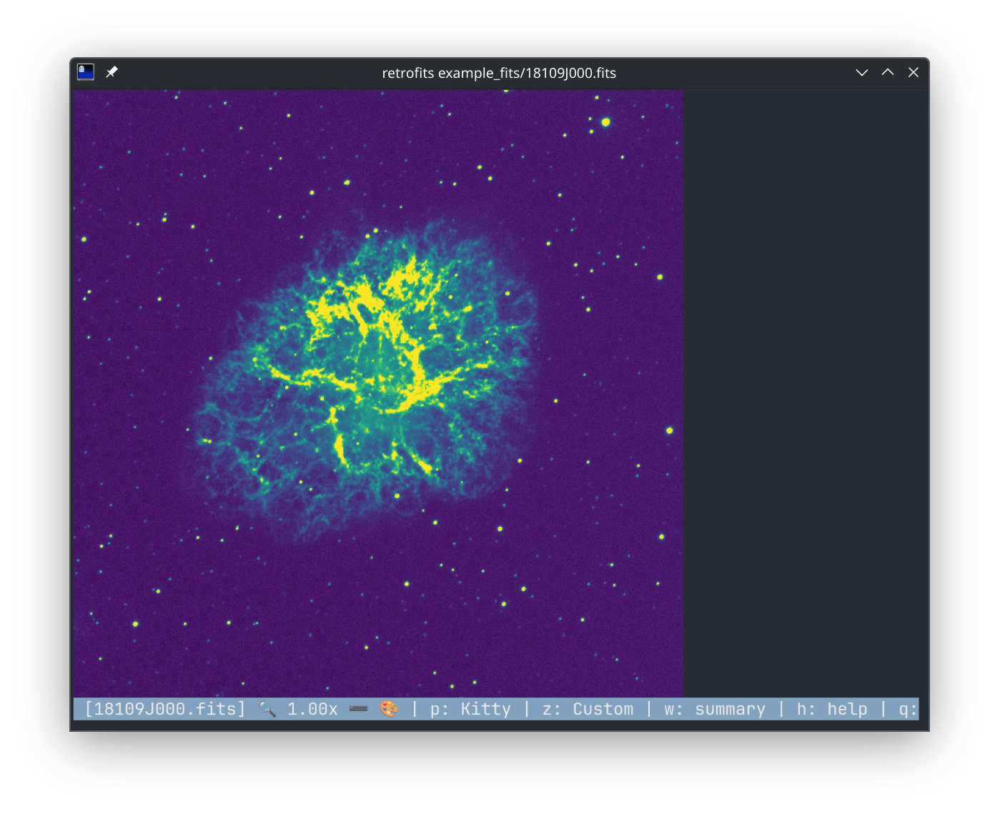
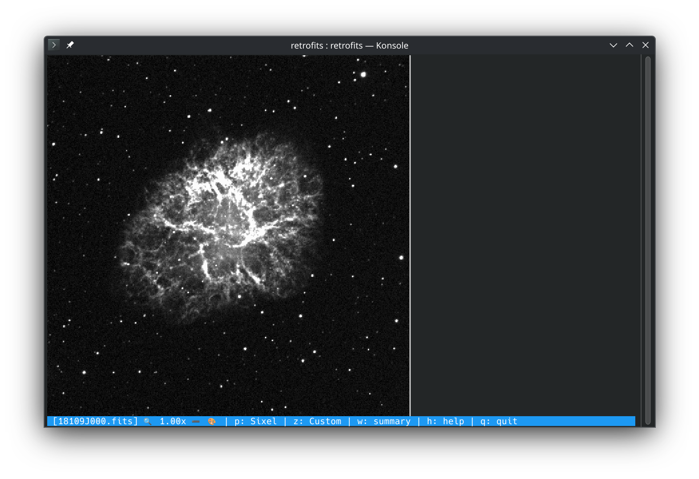

# RetroFITS

A high-performance FITS image viewer for the terminal.

RetroFITS is designed to work with modern terminal emulators, utilizing memory-mapping and zero-copy architectures to handle large astronomical data files efficiently.

## Screenshots

### Halfblocks Protocol


### Kitty Protocol (Ghostty)



### Sixel Protocol (Konsole)



## Features

- High-performance FITS viewing directly in the terminal
- Support for various rendering protocols (Kitty, iTerm2, Sixel, Halfblocks)
- Interactive exploration (zoom, pan, adjust scaling)
- Remote SSH support

## Installation

### Static Binaries (Linux)

For Linux x86_64 users, fully standalone static binaries are available on the [GitHub Releases](https://github.com/leejjoon/retrofits/releases) page. These binaries have zero runtime dependencies.

For other platforms or detailed build instructions, see [INSTALL.md](INSTALL.md).

## Usage

```bash
retrofits path/to/your/image.fits
```

By default, RetroFITS will use the `halfblocks` protocol for maximum compatibility. You can force a specific protocol using the `--protocol` flag:

```bash
retrofits --protocol kitty image.fits
retrofits --protocol sixel image.fits
```

## Keyboard Shortcuts

### General
- `q`, `Esc`: Quit application
- `h`: Show help window
- `w`: Show FITS header summary
- `e`: Select FITS extension (for multi-extension files)
- `R`: Force full screen redraw (useful for clearing artifacts)

### Navigation
- `Arrow Keys` or `h/j/k/l`: Pan image
- `+`, `i`: Zoom in
- `-`, `o`: Zoom out
- `r`: Reset zoom and pan

### Image Adjustment
- `c`: Cycle through color maps
- `s`: Cycle through stretch functions (Linear, Log, Asinh)
- `z`: Cycle through cut modes (MinMax, ZScale, Custom)
- `m`: Manually enter black/white point values

### Protocol Switching
- `p`: Cycle through rendering protocols
- `H`: Switch to Halfblocks
- `S`: Switch to Sixel
- `K`: Switch to Kitty
- `I`: Switch to iTerm2

### Rendering Artifacts

UI panels (help, summary, extension picker, manual cut) are laid out beside
the image rather than on top of it, so protocol-level redraw artifacts should
not occur. If your terminal emulator ever leaves stale graphics on screen,
press `R` to force a full clear and redraw.
